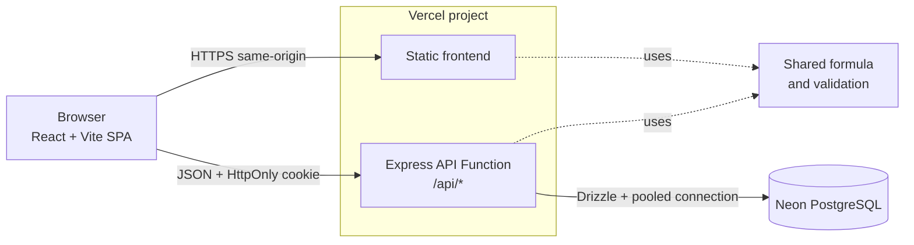

# AdForecast Pro

AdForecast Pro adalah aplikasi SaaS sederhana untuk menghitung proyeksi ROI kampanye iklan. Pengguna dapat membuat akun, menjalankan simulasi secara real-time, menyimpan hasil, dan melihat riwayat miliknya sendiri.

**Live demo:** [hillir-adforecast.vercel.app](https://hillir-adforecast.vercel.app)

## Fitur

- Register, login, pemulihan sesi, dan logout.
- Calculator Dashboard dengan sinkronisasi slider dan input angka.
- Perhitungan ROI, pendapatan, keuntungan setelah biaya iklan, jumlah hasil, target CPR, dan margin per hasil.
- Preview real-time di browser dengan perhitungan ulang di backend sebelum penyimpanan.
- Riwayat simulasi privat, terbaru lebih dahulu, dengan pagination dan drawer detail.
- Responsive layout untuk desktop dan mobile.
- Validasi input, error contract konsisten, dan protected API.

## Tech stack

| Area | Teknologi |
|---|---|
| Frontend | React, Vite, TypeScript, Tailwind CSS |
| Backend | Node.js, Express |
| Validation | Zod |
| Database | Neon PostgreSQL |
| Data access | Drizzle ORM |
| Authentication | JWT dalam cookie HttpOnly, bcrypt |
| Testing | Vitest, Supertest |
| Deployment | Vercel |

## Arsitektur



Project menggunakan satu repository dan satu package. Frontend serta API berada dalam satu project Vercel, tetapi berjalan sebagai static frontend dan serverless function yang terpisah.

Satu origin dipilih untuk menyederhanakan session cookie dan menghindari konfigurasi CORS lintas platform. API bersifat stateless; data persisten disimpan di PostgreSQL.

## Struktur repository

```text
hillir-adforecast/
├── api/        # adapter Vercel Function
├── drizzle/    # migration PostgreSQL
├── scripts/    # database dan deployment utilities
├── server/     # Express API, auth, service, dan repository
├── shared/     # formula, validation, formatter, dan types
├── src/        # React frontend
└── tests/      # unit dan integration tests
```

Folder `shared/` berisi pure domain logic yang digunakan oleh frontend dan backend. Struktur ini bukan monorepo karena seluruh aplikasi masih memakai satu root `package.json` dan satu lifecycle release.

## Logika perhitungan

```text
jumlahHasil = pengeluaranIklan / CPR
pendapatan = jumlahHasil × nilaiPesananRataRata
keuntunganSetelahIklan = pendapatan - pengeluaranIklan
ROI = keuntunganSetelahIklan / pengeluaranIklan × 100
targetCPR = hargaProduk × 30%
marginPerHasil = nilaiPesananRataRata - CPR
```

Perhitungan menggunakan `decimal.js` agar tidak bergantung pada floating-point JavaScript untuk nilai finansial. Pembulatan hanya dilakukan pada batas output.

`keuntunganSetelahIklan` belum mencakup biaya produk, pajak, fee, refund, atau biaya operasional. Target CPR sebesar 30% dari harga produk merupakan heuristic transparan dari referensi produk, bukan model machine learning.

Frontend memakai formula bersama untuk memberikan feedback real-time. Backend menghitung ulang input sebelum penyimpanan agar output dari client tidak menjadi sumber kebenaran.

## Authentication dan privasi data

- Password disimpan sebagai hash bcrypt.
- JWT berlaku tujuh hari dan hanya menyimpan user ID pada claim `sub`.
- Token dikirim melalui cookie `HttpOnly`, `Secure` pada production, dan `SameSite=Lax`.
- Route guard frontend menjaga pengalaman pengguna; authorization tetap dilakukan oleh backend.
- Endpoint calculation mengambil identitas user dari JWT, bukan dari request body atau query client.
- Query riwayat selalu difilter berdasarkan user yang terautentikasi.
- Backend mengabaikan `userId` dan output turunan yang dikirim client.
- Request yang mengubah data memeriksa origin.

## API

### Authentication

```text
POST /api/auth/register
POST /api/auth/login
POST /api/auth/logout
GET  /api/auth/me
GET  /api/auth/session
```

### Calculations

```text
POST /api/calculations
GET  /api/calculations?page=1&limit=10
```

Endpoint calculation membutuhkan sesi yang valid. History diurutkan dari data terbaru dan `limit` dibatasi maksimal 50.

### Health check

```text
GET /api/health
```

## Menjalankan secara lokal

Persyaratan:

- Node.js 22
- PostgreSQL atau project Neon

```bash
cp .env.example .env
npm install
npm run db:migrate
npm run dev
```

Frontend berjalan di `http://localhost:5173` dan API lokal di `http://127.0.0.1:3001`.

## Environment variables

| Variable | Kegunaan |
|---|---|
| `DATABASE_URL` | Pooled PostgreSQL connection untuk runtime aplikasi |
| `DATABASE_URL_UNPOOLED` | Direct connection untuk migration |
| `JWT_SECRET` | Secret penandatanganan JWT, minimal 32 byte |
| `APP_ORIGIN` | Origin frontend yang diizinkan |
| `PORT` | Port API lokal |
| `NODE_ENV` | Mode runtime |

Jangan commit file `.env` atau connection string.

## Quality checks

```bash
npm run typecheck
npm test
npm run build
npm audit --omit=dev
```

Test suite mencakup formula dan kondisi batas, validation, authentication, calculation API, manipulasi payload, pagination, serta isolasi data antar-user.

## Deployment

Frontend dan Express API dideploy melalui satu project Vercel. Database menggunakan pooled connection untuk traffic aplikasi dan direct connection untuk migration.

```bash
EXPECTED_VERCEL_EMAIL="your-vercel-email@example.com" npm run deploy:preview
EXPECTED_VERCEL_EMAIL="your-vercel-email@example.com" npm run deploy:production
```

Deployment guard memverifikasi akun Vercel aktif sebelum upload. Email dan token tidak disimpan di source code.

## Trade-off dan pengembangan berikutnya

- Offset pagination cukup untuk volume saat ini; cursor pagination lebih sesuai ketika history tumbuh besar.
- Rate limiter in-memory tidak digunakan karena tidak konsisten pada serverless multi-instance. Production dengan risiko abuse lebih tinggi sebaiknya memakai limiter persisten.
- JWT stateless menyederhanakan serverless API, tetapi session revocation membutuhkan strategi tambahan.
- Email verification, reset password, MFA, observability terpusat, dan automated browser E2E belum termasuk scope saat ini.
- Backend dapat dipisahkan ketika memerlukan WebSocket, background job panjang, scaling independen, atau release cycle berbeda.

## Penggunaan AI

AI digunakan sebagai copilot untuk membantu eksplorasi teknis, implementasi, penyusunan skenario pengujian, dan dokumentasi. Hasil akhir diverifikasi melalui automated tests, build validation, browser QA, dan production testing. Keputusan serta trade-off utama tetap dijelaskan secara eksplisit pada source code dan README ini.
